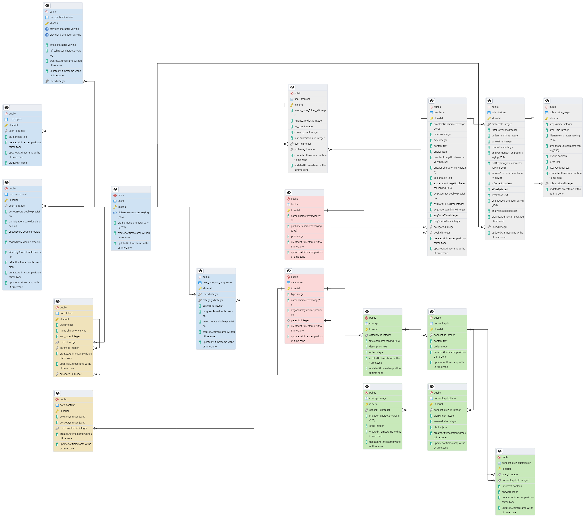
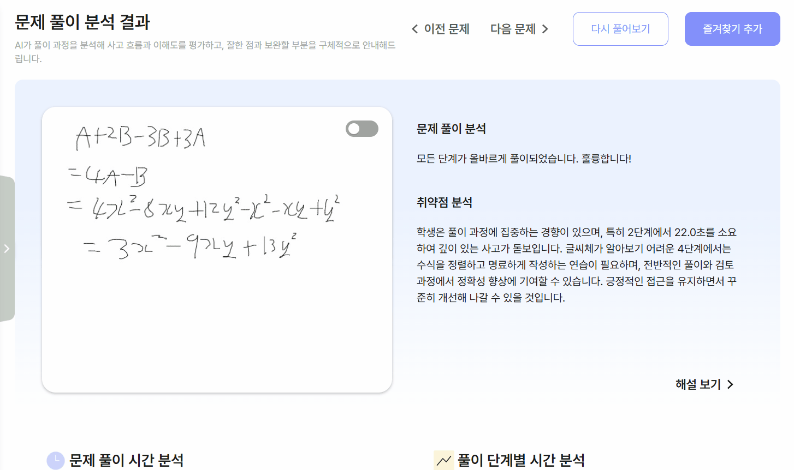
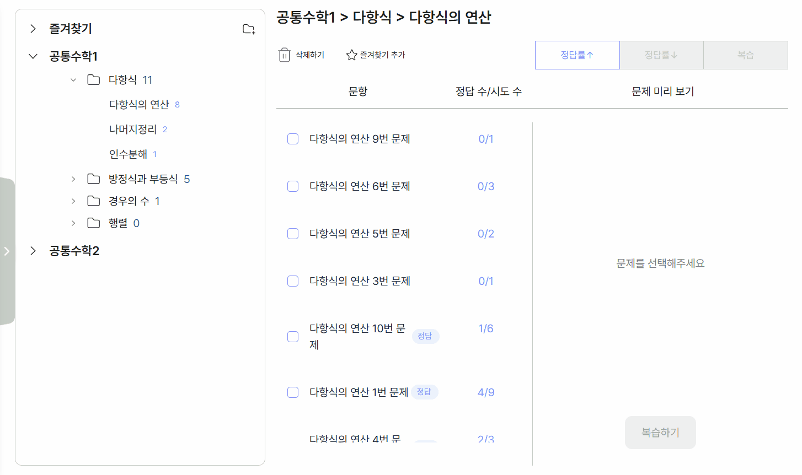
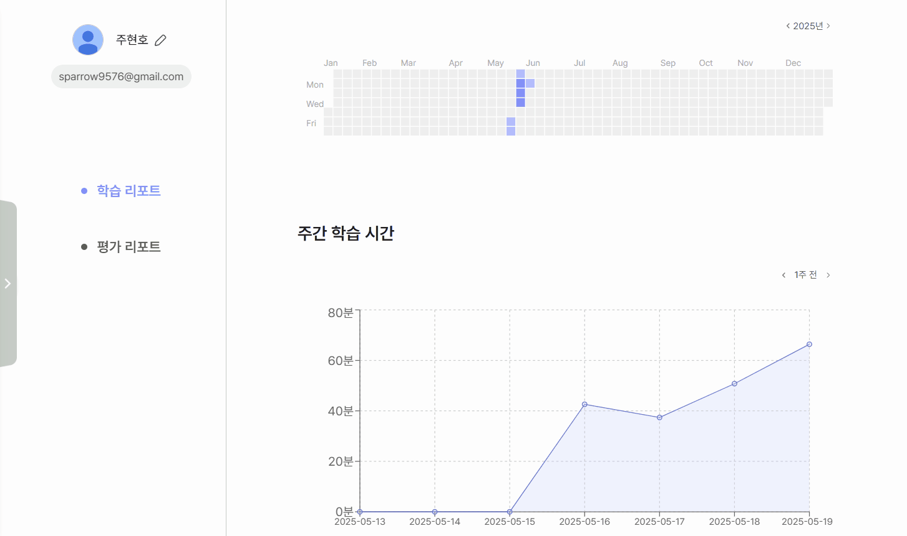

# SOUFFLE

## 📌 프로젝트 소개

### 멀티모달 AI와 함께하는 수학 풀이 분석 서비스

 

1. 수식 입력을 입력 시간과 영역에 따라 분리하여 수식 OCR의 정확성 향상
2. 순차적으로 정리된 수식을 분석하여 풀이 접근 방식을 파악
3. 취약 개념과 실수 요인들을 정리하여 사용자에게 제공
    
    

### 1️⃣ 프로젝트 기간

2025.04.14 ~ 2025.05.22

### 2️⃣ 팀원 소개

| 이름   | 역할  | 구현 기능                                                             |
| ------ | ----- | --------------------------------------------------------------------- |
| 방성준 | FE    | Wifeframe 작성, 웹앱 디자인 및 FE 개발, 수식 이미지 분할, 캔버스 구현 |
| 이승주 | FE    | Wifeframe 작성, 웹앱 디자인 및 FE 개발, 수식 이미지 분할, 캔버스 구현 |
| 주현호 | BE    | DB 설계 및 관리, API 명세서 작성, BE 개발                             |
| 김승우 | Infra | 배포 환경 구축, DB 적재 및 파싱 자동화                                |
| 남기운 | AI    | OCR 모델 고도화, 유저 지표 및 종합분석 리포트 프롬프팅                |
| 윤상흠 | AI    | 풀이 분석 모델 학습, OCR 모델 API 연동, OpenAI LLM 파이프라인 설계    |

### 3️⃣ 기술 스택

| 분야  | 기술 스택                             |
| ----- | ------------------------------------- |
| FE    | React, TypeScript                     |
| BE    | NestJS, FastAPI                       |
| AI    | pytorch, huggingface                  |
| DB    | PostgreSQL, Redis                     |
| Infra | Docker, Caddy                         |

## 📌 요구사항 명세서

- [요구사항 명세서](<exec/요구사항 명세서.pdf>)

## 📌 아키텍처 다이어그램

 

## 📌 플로우 차트

 

## 📌 와이어프레임(MVP)

.png>)

 

## 📌 API 명세서

- [API 명세서](<exec/API 명세서.pdf>)
   

## 📌 ERD 다이어그램

 

## 📌 메인 로직

 

## 📌 주요 기능

### 1.회원가입, 로그인

### 2.문제 풀이

### 3.풀이 분석

### 4.복습 노트

### 5.개념 학습

### 6.내 학습 현황

### 7. 평가 리포트

 

### 📌 배포

- 서비스 URL: https://www.souffle.kr/
- 배포 기간: 2025.04.29 ~ 2025.05.28
- [포팅 매뉴얼](exec/Building_Manual.md)
